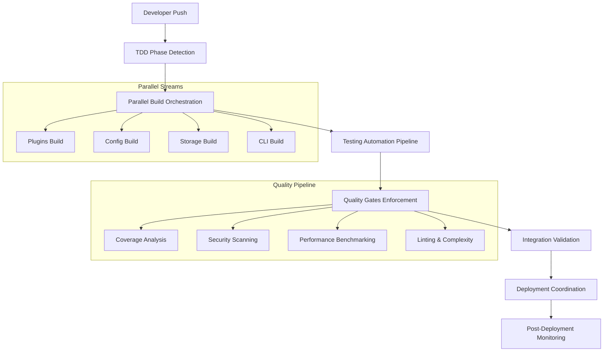
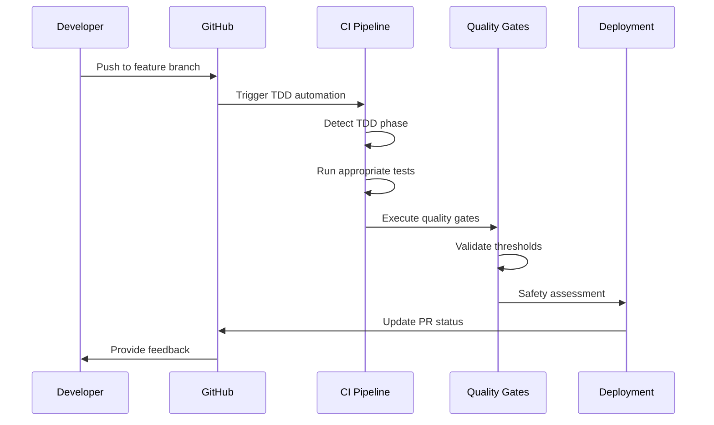

# DevOps Automation Strategy for TDD Cycle 2.3.1

## Executive Summary

This comprehensive DevOps automation strategy provides end-to-end automation for TDD Cycle 2.3.1, specifically focused on implementing hot reload functionality in the media-sync project. The strategy encompasses build orchestration, testing automation, integration validation, quality gates, and safe deployment coordination.

## 🎯 Automation Objectives

### Primary Goals
- **Automate TDD Cycle Validation**: Ensure Red-Green-Refactor compliance
- **Continuous Quality Assurance**: Maintain high code quality standards
- **Safe Hot Reload Deployment**: Enable zero-downtime plugin reloading
- **Parallel Development Support**: Coordinate multiple development streams
- **Comprehensive Monitoring**: Track quality metrics and performance

### Success Metrics
- **Code Coverage**: ≥80% overall, ≥95% for hot reload components
- **Build Success Rate**: ≥98% for all parallel builds
- **Deployment Safety**: 100% pre-deployment validation
- **Test Automation**: 100% automated test execution
- **Quality Gates**: Zero tolerance for security vulnerabilities

## 🏗️ Architecture Overview



## 🔧 Implementation Components

### 1. Build Orchestration Pipeline

**File**: `.github/workflows/tdd-hotreload-automation.yml`

#### Features
- **Parallel Component Builds**: Simultaneous building of daemon, CLI, and plugin components
- **Dependency Management**: Automated fsnotify library management and validation
- **TDD Phase Detection**: Automatic detection of Red-Green-Refactor phases
- **Build Matrix**: Multi-version Go support with parallel execution

#### Key Capabilities
```yaml
strategy:
  fail-fast: false
  matrix:
    build-target: [daemon, cli, plugins]
    go-version: ['1.25.0']
```

### 2. Continuous Testing Automation

**File**: `.github/workflows/tdd-hotreload-automation.yml` (Testing Jobs)

#### Test Suites
- **Unit Tests**: Component-level validation with race detection
- **Integration Tests**: Cross-component interaction validation
- **Hot Reload Specific**: File system watching and event debouncing tests
- **File Watcher Stress Tests**: High-load file system operation testing

#### Coverage Requirements
```bash
# Overall coverage threshold
COVERAGE_THRESHOLD: '80'
# Hot reload specific threshold  
HOTRELOAD_COVERAGE_THRESHOLD: '95'
```

### 3. Parallel Development Coordination

**File**: `.github/workflows/parallel-development.yml`

#### Capabilities
- **Stream Detection**: Automatic identification of active development branches
- **Component Isolation**: Independent development of plugins, config, storage, CLI
- **Conflict Resolution**: Automated merge conflict detection and resolution guidance
- **Cross-Component Integration**: Validation of component interactions

#### Matrix Strategy
```yaml
strategy:
  fail-fast: false
  max-parallel: 4
  matrix: ${{ fromJson(needs.coordinate-streams.outputs.matrix) }}
```

### 4. Quality Metrics Automation

**File**: `.github/workflows/quality-metrics-automation.yml`

#### Metrics Tracked
- **Code Coverage**: Trend analysis and threshold enforcement
- **Code Quality**: Linting, complexity, and duplication analysis
- **Performance**: Benchmarking and regression detection
- **Security**: Vulnerability scanning and dependency analysis

#### Quality Scoring System
```bash
# Quality score calculation
quality_score = 100
- (lint_issues * 2)
- (complex_functions * 5)  
- (security_issues * 10)
- (code_duplication ? 10 : 0)
```

### 5. Deployment Coordination

**File**: `.github/workflows/deployment-coordination.yml`

#### Safety Validations
- **Pre-Deployment Checks**: Breaking change detection and safety assessment
- **Deployment Simulation**: Full environment simulation with artifact validation
- **Hot Reload Readiness**: Specific validation of file watching and debouncing
- **Performance Impact**: Benchmark-based performance regression detection

#### Deployment Strategies
- **Hot Reload Only**: Plugin-specific changes with zero downtime
- **Rolling Update**: Gradual component updates with health monitoring
- **Full Restart**: Comprehensive system updates with maintenance windows

## 🛠️ Development Tools Integration

### Make-based Automation

**File**: `Makefile` (Enhanced)

#### New Targets
```makefile
hotreload-test:     # Hot reload specific test execution
parallel-test:      # Parallel component testing  
integration-test-full: # Comprehensive integration testing
benchmark-hotreload: # Performance benchmarking
security-scan:      # Security vulnerability scanning
tdd-cycle-validate: # TDD phase compliance validation
automation-full:    # Complete automation pipeline
```

### TDD Automation Script

**File**: `scripts/tdd-automation.sh`

#### Capabilities
- **Phase Auto-Detection**: Git history analysis for TDD phase identification
- **Quality Gate Enforcement**: Automated threshold validation
- **Hot Reload Validation**: Specific functionality verification
- **Performance Analysis**: Benchmark execution and analysis
- **Report Generation**: Comprehensive automation reporting

#### Usage Examples
```bash
# Auto-detect phase and run appropriate tests
./scripts/tdd-automation.sh

# Run specific TDD phase
./scripts/tdd-automation.sh red
./scripts/tdd-automation.sh green  
./scripts/tdd-automation.sh refactor

# Run complete TDD cycle
./scripts/tdd-automation.sh full
```

### Code Quality Configuration

**File**: `.golangci.yml`

#### Hot Reload Specific Rules
```yaml
# Allow higher complexity for file watching logic
- path: internal/plugins/hotreload.*\.go
  linters:
    - gocyclo  # File watching logic can be complex
    - funlen   # Event processing functions may be long
```

## 📊 Quality Gates & Thresholds

### Coverage Requirements
| Component | Threshold | Rationale |
|-----------|-----------|-----------|
| Overall | ≥80% | General code quality standard |
| Hot Reload | ≥95% | Critical functionality requiring high reliability |
| Plugins | ≥85% | Core system component |
| Config/Storage | ≥75% | Supporting components |

### Performance Benchmarks
| Metric | Threshold | Action |
|--------|-----------|--------|
| File Watch Event | <10ms | Warning if exceeded |
| Plugin Reload | <5s | Error if exceeded |
| Memory Usage | <50MB increase | Monitor for leaks |
| File Descriptors | <100 increase | Check for leaks |

### Security Standards
| Check | Requirement | Response |
|-------|-------------|----------|
| Vulnerability Scan | Zero high/critical | Block deployment |
| File Permissions | No 0777/0666 | Warning and review |
| Dependency Audit | Current versions | Auto-update where safe |

## 🔄 Workflow Integration

### GitHub Flow Integration


### TDD Cycle Automation
1. **RED Phase**: Validate failing tests, ensure proper TDD methodology
2. **GREEN Phase**: Verify minimal implementation passes all tests
3. **REFACTOR Phase**: Enforce quality gates and performance standards

### Parallel Development Support
- **Component Isolation**: Independent development streams for plugins, config, storage
- **Conflict Detection**: Automated identification and resolution guidance
- **Integration Validation**: Cross-component compatibility testing

## 📈 Monitoring & Observability

### Metrics Collection
- **Build Success Rates**: Track success/failure trends
- **Test Coverage Trends**: Monitor coverage evolution over time
- **Performance Baselines**: Establish and track performance benchmarks
- **Quality Scores**: Track code quality improvements

### Dashboard Integration
- **GitHub Actions**: Automated workflow status and artifact generation
- **PR Comments**: Automated deployment readiness assessments
- **Artifact Management**: Retention policies for reports and metrics

### Alerting Strategy
- **Quality Threshold Violations**: Immediate notification on coverage drops
- **Security Vulnerabilities**: Critical alerts for security issues  
- **Performance Regressions**: Warnings for benchmark degradations
- **Deployment Failures**: Emergency notifications for deployment issues

## 🚀 Deployment Orchestration

### Pre-Deployment Validation
```yaml
Safety Assessment:
  - Interface Stability Check
  - Breaking Change Detection  
  - Test Coverage Validation
  - Performance Impact Analysis
  - Security Vulnerability Scan
```

### Deployment Strategies

#### Hot Reload Only Deployment
- **Trigger**: Plugin-only changes
- **Process**: Zero-downtime plugin reload
- **Validation**: Hot reload functionality testing
- **Rollback**: Plugin-level rollback capability

#### Rolling Update Deployment
- **Trigger**: Multiple component changes
- **Process**: Gradual component updates
- **Validation**: Health checks at each stage
- **Rollback**: Component-level rollback

#### Full Restart Deployment
- **Trigger**: Breaking changes or major updates
- **Process**: Scheduled maintenance window
- **Validation**: Complete system testing
- **Rollback**: Full system rollback

### Post-Deployment Monitoring
- **System Health**: Comprehensive health check execution
- **Hot Reload Validation**: File watching and plugin reload testing
- **Performance Monitoring**: Benchmark validation in production
- **Resource Usage**: Memory and file descriptor monitoring

## 🔐 Security & Compliance

### Security Automation
- **Dependency Scanning**: Automated vulnerability detection
- **Code Security**: Static analysis with gosec
- **File Permission Audits**: Automated permission validation
- **Secrets Detection**: Prevention of credential exposure

### Compliance Measures
- **Code Quality Standards**: Enforced through automated linting
- **Documentation Requirements**: Automated validation of critical documentation
- **Testing Standards**: Minimum coverage and test quality requirements
- **Review Requirements**: Mandatory PR reviews for critical changes

## 📚 Documentation & Knowledge Management

### Automated Documentation
- **API Documentation**: Generated from code comments
- **Deployment Guides**: Auto-generated deployment procedures
- **Troubleshooting Runbooks**: Automated issue resolution guides
- **Performance Reports**: Regular benchmark and quality reports

### Knowledge Sharing
- **Best Practices**: Documented automation patterns and standards
- **Troubleshooting**: Common issue resolution procedures
- **Development Guidelines**: TDD methodology and quality standards
- **Deployment Procedures**: Step-by-step deployment instructions

## 🎯 Success Criteria & KPIs

### Automation Effectiveness
- **Build Automation**: 100% automated build processes
- **Test Automation**: 100% automated test execution
- **Quality Gates**: 100% automated quality enforcement
- **Deployment Safety**: 100% pre-deployment validation

### Quality Metrics
- **Code Coverage**: Maintain ≥80% overall, ≥95% hot reload
- **Build Success Rate**: Target ≥98% success rate
- **Deployment Safety**: Zero failed deployments due to automation gaps
- **Developer Productivity**: Reduced manual validation time by ≥80%

### Operational Efficiency
- **Time to Deploy**: Reduce deployment time by ≥60%
- **Mean Time to Recovery**: Reduce MTTR by ≥50% through automation
- **Quality Issue Detection**: 100% of quality issues caught pre-deployment
- **Developer Feedback Loop**: Reduce feedback time to <5 minutes

## 🔄 Continuous Improvement

### Regular Reviews
- **Weekly**: Review automation effectiveness and quality metrics
- **Monthly**: Assess automation coverage and identify gaps  
- **Quarterly**: Strategic review of automation strategy and tools

### Optimization Opportunities
- **Performance**: Continuous optimization of build and test execution times
- **Coverage**: Expansion of automation coverage to new components
- **Quality**: Enhancement of quality gates and validation processes
- **Developer Experience**: Improvement of feedback mechanisms and tooling

## 📞 Support & Maintenance

### Support Contacts
- **Development Team**: Primary automation maintenance and enhancement
- **Infrastructure Team**: CI/CD pipeline maintenance and scaling
- **Quality Assurance**: Quality gate definition and threshold management

### Maintenance Schedule
- **Daily**: Automated health checks and metric collection
- **Weekly**: Review automation performance and quality metrics
- **Monthly**: Update dependencies and security configurations
- **Quarterly**: Strategic review and enhancement planning

---

This DevOps automation strategy provides comprehensive automation for TDD Cycle 2.3.1, ensuring high-quality, safe deployment of hot reload functionality while maintaining developer productivity and system reliability. The strategy is designed to scale with the project's growth and adapt to evolving requirements.

**Generated**: $(date -u)  
**Version**: 1.0.0  
**Maintainer**: DevOps Team  
**Next Review**: $(date -u -d '+3 months')